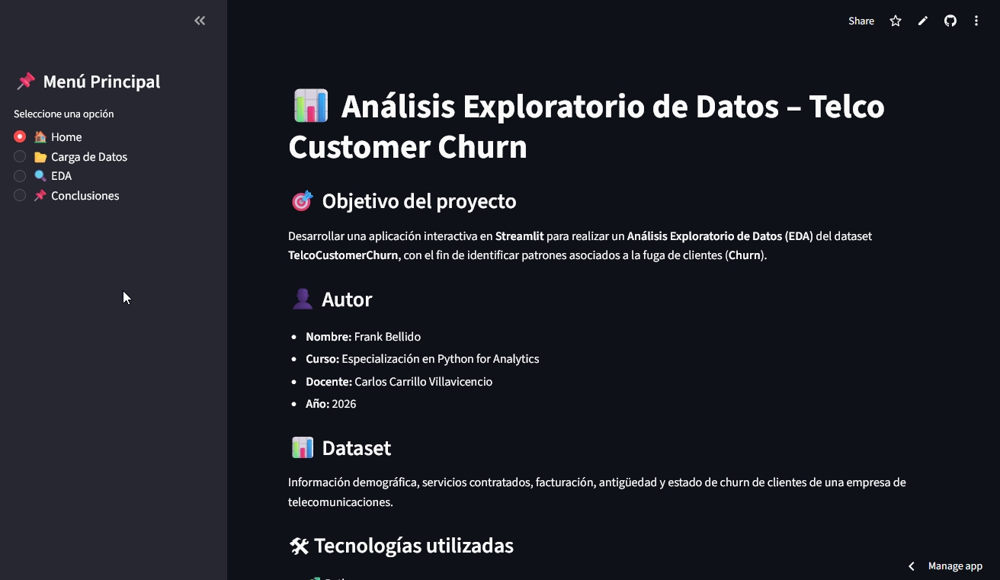
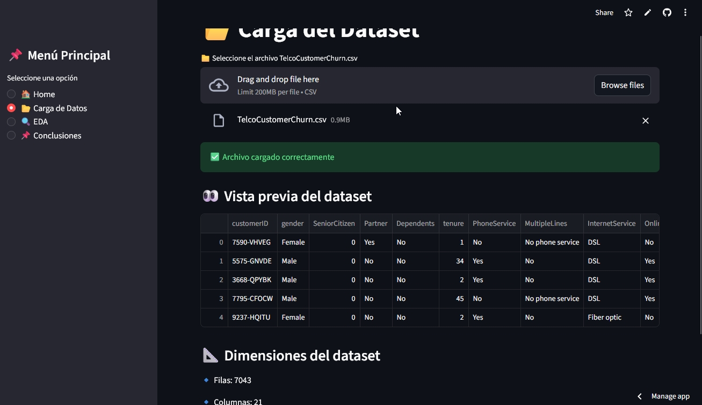
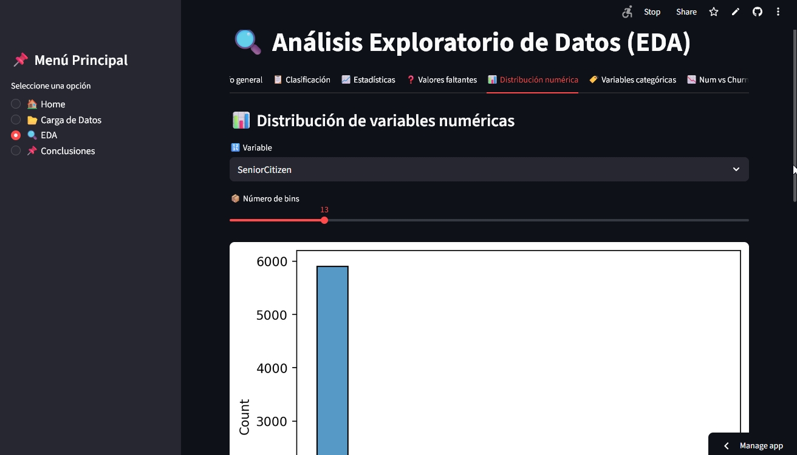
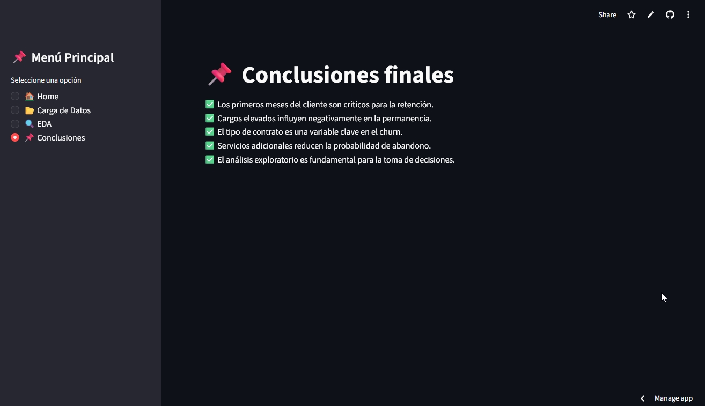

# 📊 Telco Customer Churn – Análisis Exploratorio de Datos (EDA)

## 📌 Descripción del Proyecto

Este proyecto consiste en el desarrollo de una aplicación interactiva en **Streamlit** para realizar un **Análisis Exploratorio de Datos (EDA)** sobre el dataset **Telco Customer Churn**, con el objetivo de identificar patrones y variables asociadas a la fuga de clientes (*Churn*) en una empresa de telecomunicaciones.

La aplicación permite cargar el dataset, explorar sus variables, visualizar estadísticas y analizar la relación entre distintas variables y el churn de forma dinámica.

---

## 🎯 Objetivo

Analizar los factores que influyen en la pérdida de clientes mediante técnicas de análisis exploratorio de datos, apoyando la toma de decisiones estratégicas para la retención de clientes.

---

## 🧠 Contenido del Análisis

La aplicación incluye los siguientes módulos:

* Información general del dataset
* Clasificación de variables numéricas y categóricas
* Estadísticas descriptivas (media, mediana y moda)
* Análisis de valores faltantes
* Distribución de variables numéricas
* Análisis de variables categóricas
* Relación entre variables numéricas y churn
* Relación entre variables categóricas y churn
* Análisis dinámico interactivo
* Hallazgos clave y conclusiones

---

## 🛠️ Tecnologías Utilizadas

* Python
* Pandas
* NumPy
* Matplotlib
* Seaborn
* Streamlit
* Git & GitHub

---

## 📂 Dataset

**Nombre:** TelcoCustomerChurn.csv

El dataset contiene información sobre:

* Datos demográficos de clientes
* Servicios contratados
* Tipo de contrato
* Cargos mensuales y totales
* Antigüedad del cliente
* Estado de churn (Sí / No)

---

## 🚀 Aplicación Desplegada

La aplicación se encuentra disponible en el siguiente enlace:

🔗 **Streamlit App:**
[https://telco-churn-eda-mgbrimympkksmkyuuq7rqv.streamlit.app/](https://telco-churn-eda-mgbrimympkksmkyuuq7rqv.streamlit.app/)

---

## 🖥️ Ejecución Local

Para ejecutar la aplicación en tu entorno local:

```bash
pip install -r requirements.txt
streamlit run app.py
```

---

## 📸 Capturas de Pantalla

### 🏠 Pantalla Principal



### 📂 Carga de Datos



### 📊 Análisis Exploratorio



### 📌 Conclusiones



---

## 👤 Autor

**Nombre:** Frank Bellido
**Curso:** Especialización en Python for Analytics
**Docente:** Carlos Carrillo Villavicencio
**Año:** 2026

